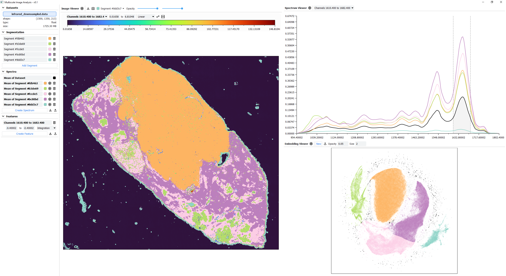

# MIA: Multiscale Image Analysis
MIA (Multiscale Image Analysis) is a visualization software for spectral imaging data. Please [contact me](mailto:hennes.rave@uni-muenster.der) for access to the software and cite it like this:

> Hennes Rave, **MIA: Multiscale Image Analysis**, https://github.com/hennesrave/multiscale-image-analysis
## Examples

##### Data Courtesy by Katharina Kronenberg, University of Graz. [[Paper]](https://chemrxiv.org/engage/chemrxiv/article-details/650d598eed7d0eccc301cd03)
