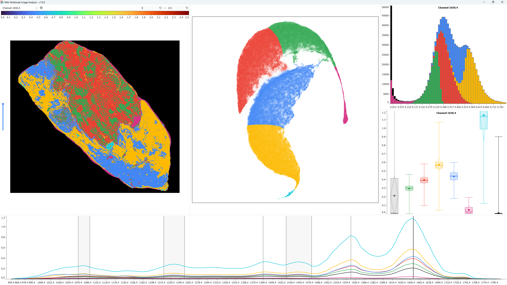

# MIA: Multiscale Image Analysis
MIA (Multiscale Image Analysis) is a visualization software for spectral imaging data. Please cite it like this:

> Hennes Rave, **MIA: Multiscale Image Analysis**, 2025. https://github.com/hennesrave/multiscale-image-analysis

## Build instructions
- Install [Qt](https://www.qt.io/) version 6.9.1 and [Qt Visual Studio Tools](https://marketplace.visualstudio.com/items?itemName=TheQtCompany.QtVisualStudioTools2022) 
- Install [Python 3.13.5](https://www.python.org/downloads/release/python-3135/) and copy `Python313/include/` and `Python313/libs/` to `external/Python313/`
- Download [pybind11 v3.0.0](https://github.com/pybind/pybind11/releases/tag/v3.0.0) and copy `pybind11-3.0.0/include/pybind11/` to `external/` 
- Download [Python 3.13.5 Windows embeddable package (64-bit)](https://www.python.org/ftp/python/3.13.5/python-3.13.5-embed-amd64.zip) and extract to `build/python/`
    - Add `"Lib/site-packages"` to `build/python/python313._pth`
- Download [get-pip.py](https://bootstrap.pypa.io/get-pip.py) and save it to `build/python/`
- Download [RenderDoc](https://renderdoc.org/) and copy `RenderDoc/renderdoc_app.h` to `external/`
- Download [spdlog](https://github.com/gabime/spdlog/releases/tag/v1.15.3) and copy `spdlog-1-15-3/include/spdlog/` to `external/`
- Download [json.hpp](https://github.com/nlohmann/json/blob/develop/single_include/nlohmann/json.hpp) and save it to `external/`

## Third-Party Licenses

This project uses third-party libraries and tools under the following licenses:

- **Python** — [Python Software Foundation License](https://docs.python.org/3/license.html)
- **Qt** — [LGPL (GNU Lesser General Public License)](https://www.gnu.org/licenses/lgpl-3.0.en.html)
- **pybind11** — [BSD-style license](https://github.com/pybind/pybind11/blob/master/LICENSE)
- **get-pip.py** — [MIT License](https://github.com/pypa/get-pip?tab=MIT-1-ov-file)
- **RenderDoc** — [MIT License](https://github.com/baldurk/renderdoc/blob/v1.x/LICENSE.md)  
- **spdlog** — [MIT License](https://github.com/gabime/spdlog/blob/v1.x/LICENSE)
- **nlohmann/json.hpp** — [MIT License](https://github.com/nlohmann/json/blob/develop/LICENSE.MIT)
- **Google Material icons** — [Apache License Version 2.0](https://www.apache.org/licenses/LICENSE-2.0.txt)

For full license details, please refer to the official repositories of these components.