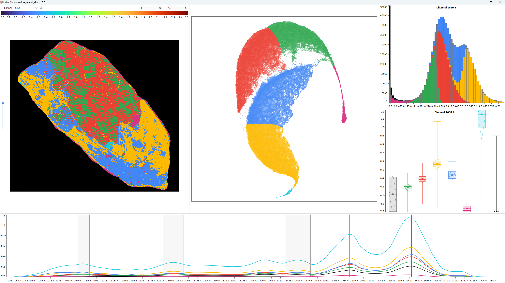

# MIA: Multiscale Image Analysis
MIA (Multiscale Image Analysis) is a visualization software for spectral imaging data. Please cite it like this:

> Hennes Rave, **MIA: Multiscale Image Analysis**, 2025. https://github.com/hennesrave/multiscale-image-analysis

## Build instructions
- Install [Qt](https://www.qt.io/) version 6.9.1 and [Qt Visual Studio Tools](https://marketplace.visualstudio.com/items?itemName=TheQtCompany.QtVisualStudioTools2022) 
- Install [Python 3.13.5](https://www.python.org/downloads/release/python-3135/) and copy `Python313/include/` and `Python313/libs/` to `external/Python313/`
- Download [pybind11 v3.0.0](https://github.com/pybind/pybind11/releases/tag/v3.0.0) and copy `pybind11-3.0.0/include/pybind11/` to `external/` 
- Download [Python 3.13.5 Windows embeddable package (64-bit)](https://www.python.org/ftp/python/3.13.5/python-3.13.5-embed-amd64.zip) and extract to `build/python/`
    - Add `"Lib/site-packages"` to `build/python/python313._pth`
	- Copy `build/python/python3.dll` and `build/python/python313.dll` to `build/`
- Download [get-pip.py](https://bootstrap.pypa.io/get-pip.py) and save it to `build/python/`
- Download [RenderDoc](https://renderdoc.org/) and copy `RenderDoc/renderdoc_app.h` to `external/`
- Download [spdlog](https://github.com/gabime/spdlog/releases/tag/v1.15.3) and copy `spdlog-1-15-3/include/spdlog/` to `external/`
- Download [json.hpp](https://github.com/nlohmann/json/blob/develop/single_include/nlohmann/json.hpp) and save it to `external/`

## Third-Party Licenses

This project uses third-party libraries and tools under the following licenses:

- **Python** — [Python Software Foundation License](https://docs.python.org/3/license.html)
- **Qt** — [LGPL (GNU Lesser General Public License)](https://www.gnu.org/licenses/lgpl-3.0.en.html)
- **pybind11** — [BSD-style license](https://github.com/pybind/pybind11/blob/master/LICENSE)
- **get-pip.py** — [MIT License](https://github.com/pypa/get-pip?tab=MIT-1-ov-file)
- **RenderDoc** — [MIT License](https://github.com/baldurk/renderdoc/blob/v1.x/LICENSE.md)  
- **spdlog** — [MIT License](https://github.com/gabime/spdlog/blob/v1.x/LICENSE)
- **nlohmann/json.hpp** — [MIT License](https://github.com/nlohmann/json/blob/develop/LICENSE.MIT)
- **Google Material icons** — [Apache License Version 2.0](https://www.apache.org/licenses/LICENSE-2.0.txt)

For full license details, please refer to the official repositories of these components.

## Getting Started
Upon starting the application, you will be prompted to import a dataset. Afterwards, the main application window will open. It consists of five views, which are described in more detail in the following sections. Most functionality is provided via context menus. If you are looking for a specific functionality, try right-clicking relevant UI components.

### Terminology
A dataset consists of `pixels` (i.e., datapoints, rows) and `channels` (i.e., dimensions, columns). Each pixel contains one `spectrum`, as well as x- and y-coordinates. The application and all of its views work on a single `segmentation` (i.e., clustering), which splits the set of pixels into `segments` (i.e., clusters). A `feature` maps each pixel to a single value, this could mean selecting single channel, or performing more complicated computations (e.g, integration, arithmetic operations). An `embedding` maps pixels (or channels) to 2D points, where similar pixels (or channels) are positioned close to each other, while dissimilar pixels (or channels) are spread apart.

---

### Spectrum Viewer
The **Spectrum Viewer** shows the dataset's channels on the x-axis and the intensity on the y-axis. For each segment, it shows the summary spectrum (`Minimum`, `Maximum`, or `Average`) over all pixels belonging to that segment. It also shows the summary spectrum over all pixels in black.

The following functionalities are available:

- Select an individual channel (`Left-click`) to create a new feature
- Select a range of channels (`Left-click + Drag`) to create a new feature
    - Choose how to accumulate the selected range (`Accumulate`, `Integrate`)
    - Choose the form of baseline correction (`From Zero`, `From Minimum`, `From Linear Baseline`)
- Remove features by hovering over them and pressing `Backspace` or `Delete`
- Zoom into a specific region of the chart (`Mouse-wheel`)
    - Zooming while hovering over an axis only changes that axis
- Change the accumulation type (`Minimum`, `Maximum`, `Average`) and visualization type (`Line`, `Lollipop`) of summary spectra
- Perform baseline correction on the entire dataset (`Minimum`, `Linear`)
- Compute derivatives along the channel dimensions on the entire dataset (`1st`, `2nd`, and `3rd` derivatives)
- Import/Export selected spectra for comparative analysis
    - Compute similarities to imported spectra using a spectral similarity metric (`Euclidean`, `Cosine`)
        - Choose the set of pixels for which to compute similarities (`Entire Dataset`, `Individual Segment`)
        - The computed similarities will be exported in the form of a new dataset
- Export the dataset into the `.mia` file format for efficient re-import (`Right-click`)
- Import an additional dataset for [multimodal analysis](#multimodal-embeddings-experimental) (`Right-click`)

---

### Image Viewer
The **Image Viewer** provides spatial context by using the pixels' x- and y-coordinates to display an image. It uses a colormap to map the values of a selected feature to colors. It also overlays the current segmentation or a false-coloring.

The following functionalities are available:

- Select the displayed feature (`Dropdown`)
    - Adjust the colormap template (`Right-click`) and range (`Number Input`)
    - Change the opacity of the entire image (`Right-click`)
    - Open the feature manager to create new feature or combine existing ones
- Zoom into a specific region of the image (`Mouse-wheel`)
    - Reset the view (`Right-click`)
- Manage the current segmentation (`Right-click`)
    - Add, remove, rename, and merge segments.
    - Change the name and color of individual segments
    - Change the currently active segment for interaction in different views
    - Create an automatic segmentation based on the dataset or the imported embedding using a clustering algorithm (`K-means`, `HDBSCAN`, `Leiden`)
    - Import/Export a segmentation
- Add pixels to the active segment using a lasso selection (`Left-click + Drag`)
- Remove pixels from all segment using a lasso selection (`Right-click + Drag`)
- Choose the coloring of the overlay (`Segmentation`, `False-coloring`)
    - See the section on [false-coloring](#false-coloring) for more information
    - Change the opacity of the overlay (`Slider` or `Right-click`)
- Export the image in column or matrix form (`.csv`) or as a screenshot (`.png`)

### Embedding Viewer
The **Embedding Viewer** displays an embedding of selected channels/features for a chosen subset of pixels. In this view, each 2D point represents one pixel, where closer point represent more similar pixels, based on the chosen similarity metric. The points are color-coded using the segmentation or a false-coloring.

The following functionalities are available:

- Create, import, and export embeddings (`Right-click`)
    - Choose which pixels to include in the embedding
    - Choose which channels/features to include in the embedding
    - Choose how to normalize the data (`Z-score`, `None`, `Min-Max`)
    - Choose the embedding algorithm (`UMAP`, `PCA`, `t-SNE`)
    - Choose whether to export the underlying model
    - Choose how to weight [different modalities](#multimodal-embeddings-experimental)
    - Open the [channel embedding viewer](#channel-embedding-viewer-experimental) (experimental)
- Zoom into a specific region of the embedding (`Mouse-wheel`)
    - Reset the view (`Right-click`)
- Manage the current segmentation (`Right-click`)
    - Add, remove, rename, and merge segments.
    - Change the name and color of individual segments
    - Change the currently active segment for interaction in different views
    - Create an automatic segmentation based on the dataset or the imported embedding using a clustering algorithm (`K-means`, `HDBSCAN`, `Leiden`)
    - Import/Export a segmentation
- Assign pixels/points that are not part of any segment to their nearest segment in the embedding (`Right-click`)
- Choose the color-coding of the points (`Segmentation`, `False-coloring`)
    - See the section on [false-coloring](#false-coloring) for more information
- Change the display size of points (`Right-click`)
- Export the scatterplot as a screenshot (`.png`)

---

### Channel Embedding Viewer (experimental)
The **Channel Embedding Viewer** displays all channels as glyphs, providing an overview of the enitire dataset. The positioning of the glyphs can be based on an embedding of the channels to group similar channels together. To remove overlap between glyphs, the layout can then be gridified, maintaining the neighbor structures as best as possible.

Additionally, abundances can be computed by accumulating the intensities per channel per segment. These abundances can be overlayed as donut charts over the glyphs, providing an overview of the distribution of intensities across segments over all channels.

The following functionalities are available:

- Adjust the visual glyph properties (`Right-click`)
    - Restrict the viewport to a selected segment
    - Choose the normalization mode (`Global`, `Glyph`)
    - Choose the colormap
- Adjust the positioning of the glyphs (`Linear`, `Embedding`, `Gridified`) (`Right-click`)
    - `Linear`shows all glyphs row by row
    - `Embedding` shows all glyphs based on an UMAP embedding of the channels
        - Choose the subset of pixels (`Entire Dataset`, `Individual Segment`)
        - Choose the similarity metric (`Pearson Correlation`, `Mutual Information`, `Euclidean`, `Cosine`)
        - The distance matrix and the embedding can be imported and exported individually
    - `Gridified` is based on the embedding, but removed overlaps between glyphs by assigning them to discrete grid locations using Linear Sum Assignment
- Overlay abundances as donut charts (`Right-click`)

---

### Histogram Viewer
The **Histogram Viewer** shows the distribution of intensities for a selected feature over all segments as a stacked histogram.

The following functionalities are available:

- Select the displayed feature (`Right-click`)
- Zoom into a specific region of the chart (`Mouse-wheel`)
    - Zooming while hovering over an axis only changes that axis
- Change the number of bins used for the histogram computation (`Right-click`)
- Open the feature manager (`Right-click`)
- Export the histogram values (`Right-click`)

---

### Boxplot Viewer
The **Boxplot Viewer** shows the distribution of intensities for a selected feature for the entire dataset and all segments as individual boxplots.

The following functionalities are available:

- Select the displayed feature (`Right-click`)
- Zoom into a specific region of the chart (`Mouse-wheel`)
    - Zooming while hovering over an axis only changes that axis
- Open the feature manager (`Right-click`)
- Export the boxplot values (`Right-click`)

---

### False-coloring
False-coloring can be used to assign colors to pixels based on their location in a 2D embedding. This is usally much better at revealing micro-structures than the manual/automatic creation of segmentation, which usually focus on macro-structures. To create a false-coloring, simply import an embedding in the [embedding viewer](#embedding-viewer) and change the coloring mode in either the image viewer or the embedding viewer (`Right-click > Coloring`).

To increase constrast, we first apply a density-equalizing transformation to the 2D points from the embedding, increasing the inter-point distances while maintaining the underlying neighborhood structures. The regularized points are then mapped into polar coordinates and then into the $C=35$ disk of the CIELCh color space.

### Multimodal Embeddings (experimental)
To create a multimodal embedding, first import an additional dataset via `Spectrum Viewer > Right-click > Dataset > Import (experimental)`. If the datasets do not share the same resolution (width $\times$ height), a dialog will open asking you to register/align them manually. The imported dataset will then be resampled to the same resolution as the original dataset. The interpolation scheme (`Nearest Neighbor`, `Bilinear`) and edge mode (`Zero`, `Clamp to Edge`) can be freely chosen.

A new application window will be opened for each imported dataset. The segmentation is shared between all application windows as all datasets should be properly algined, sharing the same number of pixels.

In the embedding creator (`Embedding Viewer > Right-click > Embedding > Create`), channels and features from multiple datasets can now be selected to create a multimodal embedding. If multiple modalities have been selected, a dialog will open where you can weight the contributions of each modality to the final embedding.